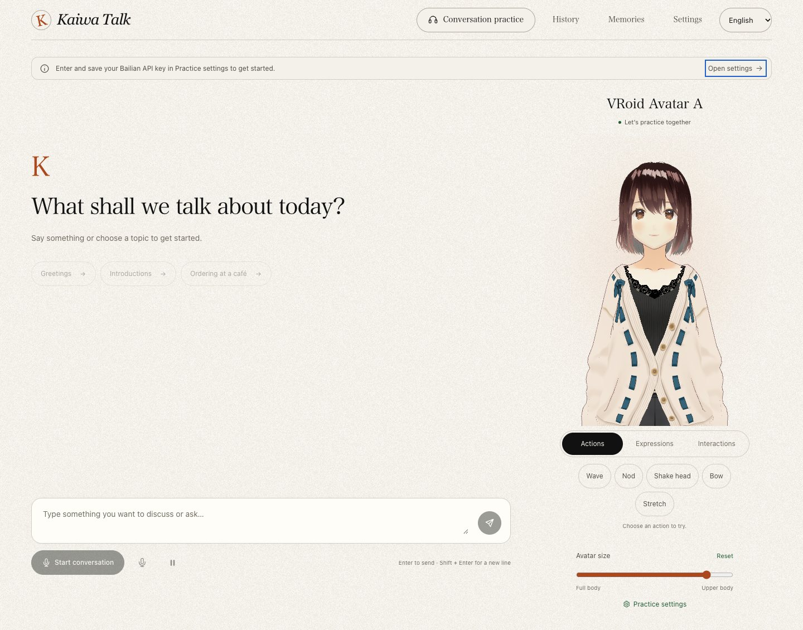
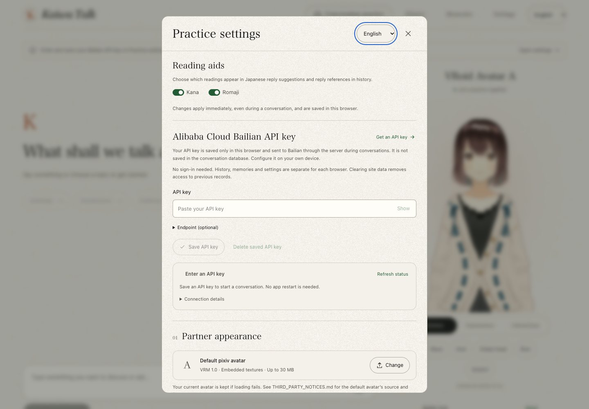

# Kaiwa Talk · AI Japanese Conversation Practice

[日本語](README.ja.md) · [简体中文](README.md) · **English**

**A few words with a virtual companion can turn the Japanese you know into Japanese you can say.**

[Try it online](https://kaiwa-talk.vercel.app/) · [Source code](https://github.com/Altria1979/kaiwa-talk) · [Issues and feedback](https://github.com/Altria1979/kaiwa-talk/issues)

## 1. Background and features

Knowing vocabulary and grammar does not always make it easy to keep a conversation going. Kaiwa Talk aims to offer a place to practise whenever you want, with room to pause, think, and try again. Start with a greeting, a self-introduction, or an order at a café, and talk to a 3D companion through voice or text.

The project connects a large language model (LLM), speech recognition (ASR), speech synthesis (TTS), and a VRM avatar. Your companion listens, composes a reply, and reads it aloud with mouth movements, expressions, and captions. When you are unsure what to say next, you can consult suggested replies, reading hints, and Japanese explanations, then review useful expressions after the conversation.

No registration or website password is required. Bring your own Alibaba Cloud Model Studio (Bailian) API key to start practising. Before configuring a key, you can still explore the interface, customise the character, try its actions, and manage settings. The interface supports 日本語, 简体中文, and English, with Japanese selected on your first visit.



| Feature | What you can do |
| --- | --- |
| Voice and text practice | Speak Japanese, or start a conversation and ask questions through text. Stop replies, mute the microphone, and turn voice back on |
| Help with replies | View 2 suggested responses with Simplified Chinese translations and kana or romaji hints. Choose “Read aloud” to practise, send a suggestion directly, or listen to a sample on demand |
| Replay and slow playback | Listen again to complete sentences already synthesised in the current conversation, or play them at 0.8× speed while preserving pitch |
| Japanese explanations and recaps | Request a brief Japanese explanation. After a conversation, receive a topic summary, three useful expressions, and one suggestion for improvement |
| 3D companion | Mouth movements, expressions, and captions alongside speech; actions such as waving, nodding, and bowing; and interactions by clicking the head, body, or hands |
| Character and practice settings | Adjust the name, personality, voice, difficulty, and pause after speaking. Import your own VRM 1.0 avatar |
| History and memories | Browse conversations and recaps. Explicitly save, edit, or delete preferences you want the companion to remember; memory suggestions are never saved automatically |
| Browser isolation | Keep history, memories, character settings, and uploaded avatars separate for each browser, with access retained after refreshing the same browser |
| Three interface languages | Switch instantly between 日本語, 简体中文, and English. Existing conversations and learning content are not translated or rewritten when you switch |

Voice input is primarily intended for Japanese. Use text to ask for help in Chinese or practise other languages. Explanations, meanings in suggested replies, and learning recaps are currently in Japanese. AI output may contain mistakes; this project does not score pronunciation or certify exam proficiency.

## 2. How to use it

### Set up your own API key

1. Open the [website](https://kaiwa-talk.vercel.app/) and choose your preferred interface language in the header.
2. Open “Practice settings”, enter your own Alibaba Cloud Model Studio (Bailian) API key, and click “Save API key”. See the [official guide](https://help.aliyun.com/zh/model-studio/get-api-key) for instructions on obtaining one.
3. The default endpoint works for the Beijing region. For another region or workspace, expand the endpoint settings and enter the corresponding domain, such as `dashscope-intl.aliyuncs.com` for Singapore. Your key and endpoint must belong to the same region.
4. Choose a practice difficulty, character personality, and voice, save your settings, and start a conversation.



Your API key is stored only in the current browser's localStorage. When making a request, the application server forwards it to Bailian; it is not written to the conversation database, URLs, or logs. localStorage is not encrypted, so use a browser you trust. You can update or remove the key in settings. Saving a key checks only the configuration format: it does not call a paid model or confirm account permissions or available quota. Actual conversations, speech recognition, speech synthesis, reply suggestions, explanations, and recaps consume your own service quota.

### Start a conversation

1. Click “Start conversation” and allow microphone access, or begin by typing. Text chat remains available if you deny microphone access.
2. Start with a simple topic, such as 「こんにちは」, 「自己紹介をしたいです」, or ordering at a café.
3. Pause briefly when you finish speaking. By default, the app waits **1.6 seconds** before submitting your utterance; you can adjust this in settings. Recognised speech, your companion's response, and playback status appear on the page.
4. If you are unsure how to respond, open the suggested replies to see the Japanese text, reading hints, and Japanese meanings. “Read aloud” enables the microphone or unmutes it; it does not automatically send the sentence for you.
5. Use “Listen again” or “Listen slowly” to hear a response again, or request a Japanese explanation. To interrupt generation and playback immediately, click “Stop current reply”.
6. Click “End conversation” to release the microphone and wait for the learning recap. Only memory suggestions you explicitly save will be used in future conversations.

Replay audio stays in browser memory for the current conversation only. It is not restored after the conversation ends, the connection drops, or the page reloads. Microphone and speaker performance depends on your device, surroundings, and browser. Headphones usually help reduce echo.

### Choose a different companion

Upload a **VRM 1.0** model from the avatar section of “Practice settings”. The limit is **30 MB**, and textures and other resources must be embedded. VRM 0.x and references to external resources are not supported. If an import fails, your previous avatar is kept. Check that the model's creator permits your intended use.

The project includes **VRoid Avatar A** from the pixiv VRoid Project as its default model. Adjust the framing from a full-body view to a close-up, and use “Actions / Expressions / Interactions” to select movements, expressions, and touch responses. These manual interactions do not call AI services. Some controls may be unavailable if a custom model lacks the required bones or expressions. See the [third-party notices](THIRD_PARTY_NOTICES.md) for the model's source and licence terms.

### Records and privacy

- The site creates a separate browser identity automatically, without a login. History, memories, settings, and avatars are stored on the server and isolated by that identity. **Not all data is stored only in your browser.**
- Tabs using the same browser profile and site origin share records. Each browser can have one active conversation at a time; different browsers can practise independently.
- Clearing site data, closing a private browsing session, changing browsers, or moving to another domain may remove your access to previous records. There is currently no account login, cross-device sync, or identity recovery.
- Bailian receives audio for recognition, conversation context, and text to synthesise. The app does not persist raw microphone recordings. Your key is never used as a default server credential for other visitors.
- Shared data from older private deployments remains in its original tables and files. It is not automatically assigned or exposed to new visitors.

### Run locally

You need **Node.js 24**, **pnpm 9.9.0**, and a modern browser with WebGL, Web Audio, and AudioWorklet support. Clone the repository and run the following commands from the project root:

```sh
git clone https://github.com/Altria1979/kaiwa-talk.git
cd kaiwa-talk
nvm use
corepack enable
pnpm install --frozen-lockfile
pnpm dev
```

Open [http://localhost:3000](http://localhost:3000). The launcher starts the Next.js website and a Node service on port 3001 together. The default avatar is included in the repository, so no separate character download is needed. VAD assets are generated from pinned dependencies during startup and builds.

If the port is occupied, run `KAIWA_TALK_WEB_PORT=13000 pnpm dev`; the backend automatically uses the next port. Local data is saved in the Git-ignored `data/` directory. You do not need `.env.local` when using the built-in AI model names. Configure your API key in the web interface as usual.

To build and run the production version:

```sh
pnpm build
pnpm start
```

### Deploy to your own Vercel project

The project uses **Vercel Services**. Next.js serves the pages, while a Node.js container handles HTTP, WebSocket, and voice sessions. Turso stores structured data, and **Private Vercel Blob** stores uploaded models. A server runtime is required; this is not a purely static export.

See the [Vercel deployment guide](docs/vercel-deployment.md) for setup steps, the signing secret, and database and Blob environment variables. Visitors bring their own model-service keys; the deployment owner covers application hosting, database, storage, and traffic costs. Currently, only the size of each avatar file is limited, with no cumulative upload quota. Configure deployment-side rate limits, usage monitoring, and storage management before opening the service to a larger audience.

## 3. Technical implementation and acknowledgements

### Technology stack

| Area | Implementation |
| --- | --- |
| Web application and types | [Next.js 16](https://github.com/vercel/next.js) App Router, [React 19](https://github.com/facebook/react), and [TypeScript 5.9](https://github.com/microsoft/TypeScript) |
| Interface and localisation | CSS Modules, global styles, and project-owned Chinese, Japanese, and English dictionaries; all three languages share the application routes |
| Avatars | [Three.js](https://github.com/mrdoob/three.js) and [three-vrm](https://github.com/pixiv/three-vrm) load VRM 1.0 models and drive mouth movements, poses, and expressions |
| Conversation and speech | Bailian Qwen chat models, Fun-ASR realtime recognition, and Qwen realtime TTS; environment configuration controls the default models |
| Audio and voice activity detection | Web Audio, AudioWorklet, [vad-web](https://github.com/ricky0123/vad), [Silero VAD](https://github.com/snakers4/silero-vad), and [ONNX Runtime](https://github.com/microsoft/onnxruntime) |
| Realtime service | Node.js 24, [ws](https://github.com/websockets/ws), HTTP APIs, and a WebSocket event protocol |
| Persistence | [better-sqlite3](https://github.com/WiseLibs/better-sqlite3) locally; Turso/libSQL and private Vercel Blob in the cloud |
| Quality and deployment | Node's built-in test runner, tsx, TypeScript, and ESLint; Vercel Services with a Docker backend |

### Key implementation details

- **Cancellable realtime conversations:** Each reply has its own turn. Recognition, text generation, sentence-level synthesis, and playback are coordinated, and old work is cancelled when you stop or interrupt a reply so that stale results cannot overwrite a newer response. See [`server/session.ts`](server/session.ts) and [`use-conversation.ts`](src/hooks/use-conversation.ts).
- **Context that reflects what was heard:** The browser acknowledges a sentence only after it finishes playing naturally. Subsequent voice context distinguishes completed playback from interrupted replies. Replay and slow playback reuse audio from the same turn. See [`browser-audio.ts`](src/lib/browser-audio.ts).
- **Lightweight speech detection:** Local VAD provides voice activity signals, combined with valid cloud recognition results to confirm interruptions. Fun-ASR determines final utterance boundaries; the recording is not submitted twice in sequence. This is not a pronunciation scoring system.
- **Isolation by browser identity:** A signed HttpOnly cookie binds APIs, WebSockets, database queries, session leases, and private avatar paths to the same identity. Sharing a database connection does not mean sharing visitor records. See [`cloud-access.ts`](shared/cloud-access.ts), [`storage.ts`](server/storage.ts), and [`avatars.ts`](server/avatars.ts).
- **Avatar behaviour separate from conversation requests:** Manual actions do not trigger chat requests. Automatic expressions are extracted from the same reply, mouth movements follow actual playback volume, and captions approximately follow progress within each sentence. See [`avatar-stage.tsx`](src/components/avatar-stage.tsx).

Run the quality checks with:

```sh
pnpm lint
pnpm typecheck
pnpm test
pnpm build
```

Automated tests use mocked model responses and temporary storage; a real Bailian API key is not required. See the [development and advanced usage guide](docs/development.md) for model configuration, audio limitations, directory structure, and troubleshooting.

### References and thanks

Thanks to the maintainers of the open-source projects above and to the pixiv VRoid Project for its sample character. The default avatar, VAD models, runtime assets, and code dependencies each retain their original licence terms. Sources and pinned versions are recorded in [THIRD_PARTY_NOTICES.md](THIRD_PARTY_NOTICES.md).

This README follows the organisation of the author's [Pokotype](https://github.com/Altria1979/pokotype) project: introduce the product and how to use it first, then explain the implementation and related resources.

## 4. Contact the author

Feedback about voice connections, avatar loading, and the conversation experience is welcome, as are discussions about Japanese learning use cases.

- **WeChat: `Altria1979`**
- GitHub: [Altria1979](https://github.com/Altria1979)
- Issues and feedback: [Open an issue](https://github.com/Altria1979/kaiwa-talk/issues)

Please include your browser and operating system versions, steps to reproduce the issue, error messages, and relevant screenshots. **Do not include API keys, cookies, environment files, or private conversations.**

## 5. Licensing and third-party assets

The application source code is licensed under the [MIT License](LICENSE). Copyright © 2026 Altria1979. Third-party assets and dependencies are covered by the licences described below.

The default VRM character is subject to its embedded VRM Public License 1.0 and the official VRoidPreset A–Z terms. It is **not CC0**. Dependencies and bundled resources remain subject to their respective licences. See the [third-party asset and code notices](THIRD_PARTY_NOTICES.md) for details.
