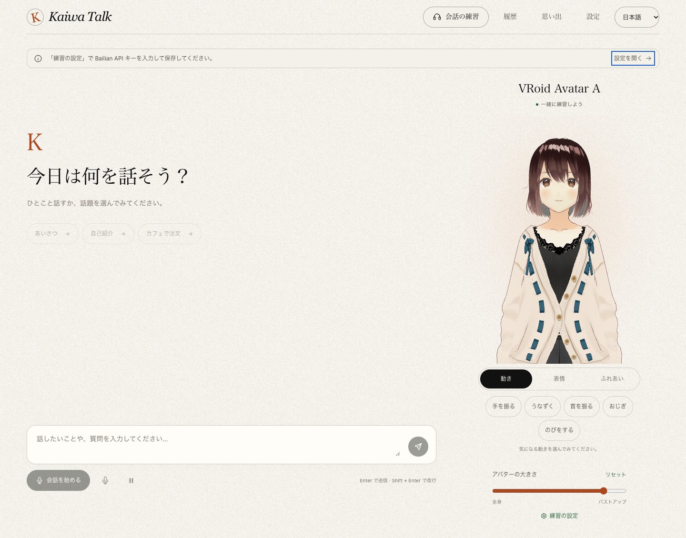
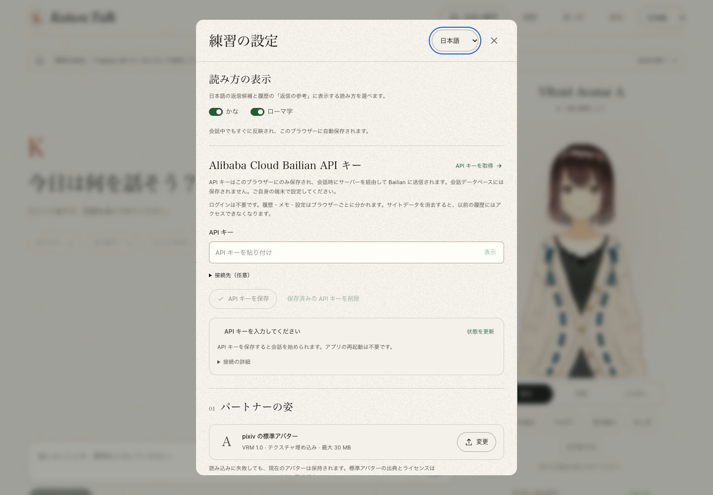

# Kaiwa Talk · AI と日本語会話練習

**日本語** · [简体中文](README.md) · [English](README.en.md)

**バーチャルな話し相手と少しずつ。「頭に浮かぶ日本語」を「口に出せる日本語」へ。**

[オンラインで試す](https://kaiwa-talk.vercel.app/) · [ソースコード](https://github.com/Altria1979/kaiwa-talk) · [不具合・要望](https://github.com/Altria1979/kaiwa-talk/issues)

## 1. プロジェクトの背景と機能

単語や文法を覚えていても、いざ話そうとすると次の言葉が出てこない。日本語を練習していると、そんな場面によく出会います。Kaiwa Talk は、いつでも始められ、途中で考えたり、言い直したりできる会話の場を目指しています。あいさつ、自己紹介、カフェでの注文といった身近な話題から、画面の中の 3D パートナーと音声や文字でやり取りできます。

大規模言語モデル（LLM）、音声認識（ASR）、音声合成（TTS）、VRM アバターを組み合わせています。パートナーは発話を聞き取り、返信を考えて読み上げ、口の動きや表情、字幕でも応えます。返事に迷ったときは返信候補、読み方のヒント、日本語の説明を確認でき、会話の後には学んだ表現を振り返れます。

登録やサイトのパスワードは不要です。自分の Alibaba Cloud Bailian（百炼）の API キーで会話を始められます。キーを設定する前でも、画面の閲覧、キャラクターの調整、アクションの確認、設定の管理は可能です。表示言語は日本語・简体中文・English に対応し、初回は日本語で開きます。



| 機能 | できること |
| --- | --- |
| 音声・文字での会話練習 | 日本語で話すほか、文字で会話を始めたり質問したりできます。返信の停止、マイクのミュート、音声会話の再開にも対応 |
| 返事のサポート | 3 つの返信候補と、かな・ローマ字の読み方を確認。「読み上げる」で練習するか、そのまま送信できます。必要に応じて見本の音声も再生可能 |
| 聞き直しと低速再生 | 現在の会話で合成済みの文を聞き直せます。音の高さを保ったまま 0.8 倍速で再生可能 |
| 日本語の説明と振り返り | 必要に応じて簡潔な日本語の説明を表示。会話終了後には話題の要約、使える表現 3 つ、改善のヒント 1 つを生成 |
| 3D パートナー | 音声に合わせた口の動き、表情、字幕。手を振る・うなずく・おじぎなどの動作や、頭・体・手をクリックする触れ合い |
| キャラクターと練習の設定 | 名前、性格、声、難易度、話し終わってからの待ち時間を調整。自分の VRM 1.0 アバターも読み込み可能 |
| 履歴と思い出 | 会話と振り返りを確認。覚えてほしい好みなどを自分で保存・編集・削除できます。思い出の候補は自動保存されません |
| ブラウザーごとの分離 | 履歴、思い出、キャラクター設定、アップロードしたアバターをブラウザーごとに分離。同じブラウザーなら再読み込み後も利用可能 |
| 3 言語の表示 | 日本語・简体中文・English をその場で切り替え。保存済みの会話や学習内容は、切り替えによって翻訳・書き換えられません |

音声入力は主に日本語を対象としています。中国語での質問や他の言語の練習には文字入力を利用できます。説明、返信候補の意味、学習の振り返りは現在、日本語で表示されます。AI の内容には誤りが含まれる場合があり、発音の採点や試験能力の認定は行いません。

## 2. 使い方

### 自分の API キーを設定する

1. [オンラインサイト](https://kaiwa-talk.vercel.app/)を開き、ヘッダーで使いやすい表示言語を選びます。
2. 「練習の設定」を開き、自分の Bailian API キーを入力して「API キーを保存」を押します。取得方法は[公式ガイド](https://help.aliyun.com/zh/model-studio/get-api-key)を参照してください。
3. 北京リージョンでは既定の接続先を使えます。他のリージョンやワークスペースを使う場合は接続先の設定を開き、対応するドメインを指定します。シンガポールの例は `dashscope-intl.aliyuncs.com` です。キーと接続先のリージョンを一致させてください。
4. 練習の難易度、パートナーの性格、声を選んで保存し、会話を始めます。



API キーの保存先は現在のブラウザーの localStorage のみです。呼び出し時にはアプリのサーバーを経由して Bailian へ送信されますが、会話データベース、URL、ログには書き込みません。localStorage は暗号化されないため、自分の信頼できるブラウザーを使ってください。キーは設定から更新・削除できます。保存時に確認するのは設定の形式だけで、有料モデルは呼び出しません。アカウントの権限や利用可能な残量を確認したことにもなりません。実際の会話、音声認識、音声合成、返信候補、説明、振り返りには、自分のサービス利用枠が使われます。

### 会話を始める

1. 「会話を始める」を押してマイクを許可するか、文字を入力します。マイクを許可しなくても文字で会話できます。
2. 「こんにちは」「自己紹介をしたいです」や、カフェでの注文など、簡単な話題から始めます。
3. 話し終えたら少し待ちます。既定では **1.6 秒**の間を置いて発話を送信し、この待ち時間は設定で調整できます。認識結果、パートナーの返信、再生状態は画面に表示されます。
4. 返事に迷ったら返信候補を開き、日本語、読み方、日本語での意味を確認します。「読み上げる」を選ぶとマイクが有効になるか、ミュートが解除されます。その文が自動で送信されることはありません。
5. 聞き直したいときは「もう一度聞く」や低速再生を使います。日本語の説明も求められます。生成と再生をすぐに止めたい場合は「現在の返信を停止」を押します。
6. 「会話を終了」を押してマイクを解放し、振り返りを待ちます。思い出の候補は、自分で保存したものだけが今後の会話に使われます。

聞き直し用の音声は、現在の会話中だけブラウザーのメモリーに保持されます。終了、切断、再読み込み後には復元されません。マイクとスピーカーの使い心地は機器、周囲の環境、ブラウザーに左右されます。ヘッドホンを使うと、エコーを抑えやすくなります。

### 好きなパートナーに変更する

「練習の設定」のアバター項目から **VRM 1.0** モデルをアップロードできます。上限は **30 MB** で、テクスチャーやリソースはファイルに埋め込まれている必要があります。VRM 0.x や外部リソースの参照には対応していません。読み込みに失敗した場合は元のアバターが維持されます。事前にモデル作者の利用条件を確認してください。

既定のモデルとして、pixiv VRoid Project の **VRoid Avatar A** を同梱しています。全身から近景まで表示範囲を調整し、「動き／表情／ふれあい」で動作や表情、触れたときの反応を切り替えられます。これらの手動操作自体は AI を呼び出しません。カスタムモデルに必要なボーンや表情がない場合、一部の操作は利用できません。出典とライセンスは[第三者素材の表記](THIRD_PARTY_NOTICES.md)を参照してください。

### 記録の保存とプライバシー

- ログイン不要で、ブラウザーごとに独立した識別情報を自動的に発行します。履歴、思い出、設定、アバターはサーバーに保存され、識別情報ごとに分離されます。**すべてのデータがブラウザー内だけに保存されるわけではありません。**
- 同じブラウザープロファイルとサイトのオリジンを使うタブ間では記録を共有します。同じブラウザーで同時に進められる会話は 1 つですが、別のブラウザーではそれぞれ会話できます。
- サイトデータの削除、プライベートウィンドウの終了、ブラウザーやドメインの変更によって、以前の記録へアクセスできなくなる場合があります。アカウントログイン、端末間の同期、識別情報の復旧機能はありません。
- Bailian には、認識用の音声、会話の文脈、音声合成するテキストが送られます。アプリはマイクの生録音を永続保存しません。自分のキーが、他の利用者向けのサーバー既定キーとして使われることもありません。
- 旧版のプライベートなデプロイで共有されていたデータは元のテーブルとファイルに残り、新しい訪問者へ自動的に割り当てたり公開したりしません。

### ローカルで実行する

**Node.js 24**、**pnpm 9.9.0**、WebGL・Web Audio・AudioWorklet に対応するモダンブラウザーが必要です。次のコマンドで取得し、プロジェクトのルートから起動します。

```sh
git clone https://github.com/Altria1979/kaiwa-talk.git
cd kaiwa-talk
nvm use
corepack enable
pnpm install --frozen-lockfile
pnpm dev
```

[http://localhost:3000](http://localhost:3000) を開きます。ランチャーは Next.js のページと、ポート 3001 の Node サービスを同時に起動します。既定のアバターはリポジトリに含まれているため、キャラクターを別途ダウンロードする必要はありません。VAD のリソースは、起動時とビルド時に固定された依存パッケージから生成されます。

ポートが使用中の場合は `KAIWA_TALK_WEB_PORT=13000 pnpm dev` を実行すると、サーバーにはその次のポートが使われます。ローカルデータは Git の対象外となっている `data/` に保存されます。既定の AI モデル名を使う場合は `.env.local` は不要で、API キーは引き続き画面から設定します。

本番用にビルドして起動するには、次を実行します。

```sh
pnpm build
pnpm start
```

### 自分の Vercel にデプロイする

**Vercel Services** を使用します。Next.js がページを提供し、Node.js コンテナーが HTTP、WebSocket、音声セッションを処理します。構造化データは Turso、アップロードしたモデルは **Private Vercel Blob** に保存します。サーバーの実行環境が必要で、静的エクスポートのみのサイトではありません。

手順、署名用シークレット、データベースと Blob の環境変数は [Vercel デプロイガイド](docs/vercel-deployment.md)を参照してください。利用者は自分のモデルサービスのキーを使い、デプロイする側はアプリ、データベース、ストレージ、通信の費用を負担します。現状ではアバターファイル 1 個のサイズだけを制限しており、累計アップロード容量の上限はありません。より多くの訪問者に公開する際は、デプロイ環境でのレート制限、利用量の監視、ストレージ管理を設定してください。

## 3. 技術構成とオープンソースへの謝辞

### 技術スタック

| 分野 | 実装 |
| --- | --- |
| ページと型 | [Next.js 16](https://github.com/vercel/next.js) App Router、[React 19](https://github.com/facebook/react)、[TypeScript 5.9](https://github.com/microsoft/TypeScript) |
| UI と多言語対応 | CSS Modules、グローバルスタイル、独自の中・日・英辞書。3 言語でアプリのルートを共有 |
| アバター | [Three.js](https://github.com/mrdoob/three.js) と [three-vrm](https://github.com/pixiv/three-vrm) により VRM 1.0 を読み込み、口の動き・姿勢・表情を制御 |
| 会話と音声 | Bailian の Qwen 会話モデル、Fun-ASR リアルタイム認識、Qwen リアルタイム TTS。既定モデルは環境設定で指定 |
| 音声処理と発話検出 | Web Audio、AudioWorklet、[vad-web](https://github.com/ricky0123/vad)、[Silero VAD](https://github.com/snakers4/silero-vad)、[ONNX Runtime](https://github.com/microsoft/onnxruntime) |
| リアルタイムサービス | Node.js 24、[ws](https://github.com/websockets/ws)、HTTP API、WebSocket イベントプロトコル |
| データ保存 | ローカルは [better-sqlite3](https://github.com/WiseLibs/better-sqlite3)、クラウドは Turso/libSQL と非公開の Vercel Blob |
| 品質確認とデプロイ | Node 標準テスト、tsx、TypeScript、ESLint。Vercel Services と Docker バックエンド |

### 主な実装

- **キャンセル可能なリアルタイム会話**：返信ごとに独立したターンを割り当て、認識、テキスト生成、文ごとの音声合成、再生を連携させます。停止や割り込み時に古い処理をキャンセルし、遅れて届いた結果が新しい返信を上書きしないようにします。[`server/session.ts`](server/session.ts)、[`use-conversation.ts`](src/hooks/use-conversation.ts) を参照してください。
- **実際に聞いた内容を反映する文脈**：ブラウザーは文が自然に最後まで再生された場合にだけ再生完了を通知します。その後の音声会話では、聞き終えた内容と中断された返信を区別します。聞き直しと低速再生には、そのターンの音声を再利用します。[`browser-audio.ts`](src/lib/browser-audio.ts) を参照してください。
- **軽量な発話検出**：ローカル VAD の人声検出とクラウドの有効な認識結果を組み合わせ、割り込みを確認します。最終的な発話の区切りは Fun-ASR が判断し、同じ録音を順番に二重送信する方式ではありません。発音を採点する仕組みではありません。
- **ブラウザー識別情報による分離**：署名付き HttpOnly Cookie を使い、API、WebSocket、データベースクエリー、会話のリース、非公開アバターのパスを同じ識別情報に結び付けます。データベース接続を共有していても、利用者の記録は分離されます。[`cloud-access.ts`](shared/cloud-access.ts)、[`storage.ts`](server/storage.ts)、[`avatars.ts`](server/avatars.ts) を参照してください。
- **キャラクターの表現と会話処理の分離**：手動アクションは会話リクエストを発生させません。自動表情は同じ返信から抽出し、口の動きは実際の再生音量で制御します。字幕は文内の再生進行におおよそ合わせて表示します。[`avatar-stage.tsx`](src/components/avatar-stage.tsx) を参照してください。

品質チェックは次のコマンドで実行します。

```sh
pnpm lint
pnpm typecheck
pnpm test
pnpm build
```

自動テストにはモデル応答のモックと一時ストレージを使うため、実際の Bailian API キーは不要です。モデル設定、音声の制限、ディレクトリ構成、トラブルシューティングは[開発・応用ガイド](docs/development.md)を参照してください。

### 参考と謝辞

上記オープンソースプロジェクトのメンテナーと、サンプルキャラクターを提供する pixiv VRoid Project に感謝します。既定のアバター、VAD モデル、ランタイムのリソース、コードの依存パッケージには、それぞれ元のライセンスが適用されます。出典と固定バージョンの記録は [THIRD_PARTY_NOTICES.md](THIRD_PARTY_NOTICES.md) にまとめています。

この README は、同じ作者による [Pokotype](https://github.com/Altria1979/pokotype) の構成を参考にしています。まず製品と使い方を紹介し、その後に技術構成と関連資料を説明しています。

## 4. 作者への連絡

音声接続、アバターの読み込み、会話体験に関する問題や、日本語学習での活用について、気軽にご連絡ください。

- **WeChat／微信：`Altria1979`**
- GitHub：[Altria1979](https://github.com/Altria1979)
- 不具合・要望：[Issue を作成](https://github.com/Altria1979/kaiwa-talk/issues)

ブラウザーと OS のバージョン、再現手順、エラーメッセージ、必要なスクリーンショットを添えてください。**API キー、Cookie、環境設定ファイル、個人的な会話は添付しないでください。**

## 5. ライセンスと第三者素材

このリポジトリでは、現時点でアプリのソースコードに対するライセンスを個別に指定していません。リポジトリの公開と第三者素材の利用許諾は別のものです。他のプロジェクトのライセンスを、そのまま本プロジェクトに適用しないでください。

既定の VRM キャラクターには、ファイル内の VRM Public License 1.0 と VRoidPreset A–Z の公式条件が適用されます。**CC0 ではありません。** 依存パッケージと同梱リソースには、それぞれのライセンスが引き続き適用されます。詳細は[第三者素材・コードの表記](THIRD_PARTY_NOTICES.md)を参照してください。
