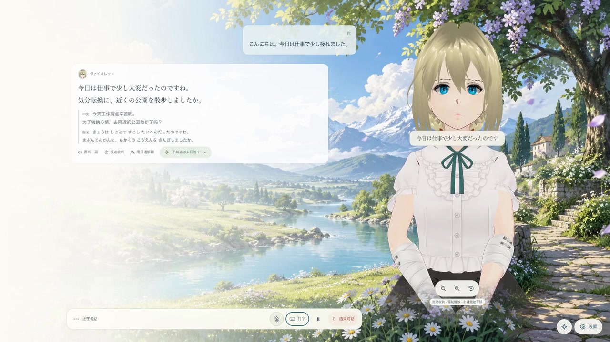
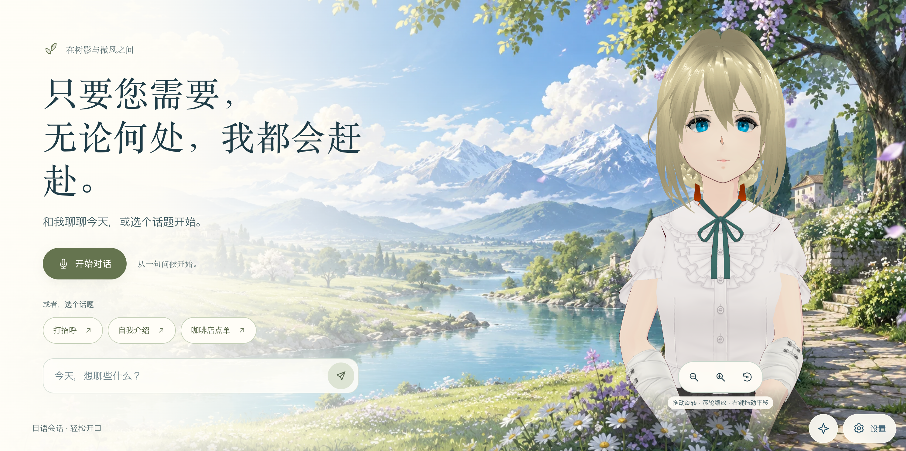
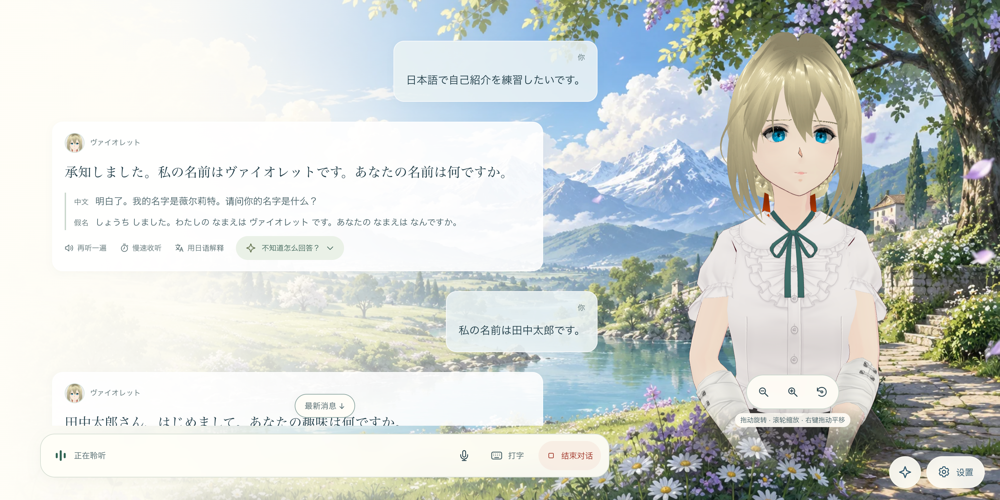
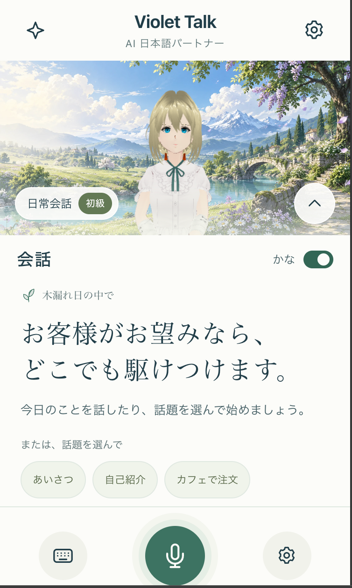

# Violet Talk · AI 日语对练

[日本語](README.ja.md) · **简体中文** · [English](README.en.md)

[](docs/media/violet-talk-demo.mp4)

[▶ 查看／下载演示视频](docs/media/violet-talk-demo.mp4) · 54 秒 · 720p · 6.2 MB · 实际日语对话与百炼复刻音色

**和虚拟伙伴聊几句，让日语从“想得出来”变成“说得出口”。**

[在线体验](https://kaiwa-talk.vercel.app/) · [应用源码](https://github.com/Altria1979/kaiwa-talk) · [问题反馈](https://github.com/Altria1979/kaiwa-talk/issues)

## 1. 项目背景与功能

学过单词和语法，真正开口时却不知道怎么接话，是日语练习中很常见的困难。Violet Talk 希望提供一个随时可以开始、允许停顿和重来的对话环境：从打招呼、自我介绍、咖啡店点单等小话题出发，和屏幕里的 3D 虚拟伙伴进行语音或文字交流。仓库名称及部署地址沿用 `kaiwa-talk`。

项目把大语言模型（LLM）、语音识别（ASR）、语音合成（TTS）和 VRM 虚拟形象连接起来。伙伴会听你说话、组织回复并朗读，配合口型、表情和字幕。你可以按自己的想法自由表达；需要帮助时，再点开「不知道怎么回答？」查看参考回复，也可以使用读音提示和日语解释，结束后回顾这次学到的表达。

无需注册或网站密码。使用自己的阿里云百炼 API Key 开始对练；未配置密钥时仍可浏览界面、调整角色、查看动作和管理设置。界面支持日本語、简体中文和 English，首次打开默认日语。



桌面首页、对话与下方手机首页截图更新于 2026-10-02；设置截图展示未填写 API Key 时的配置入口。

| 功能 | 可以做什么 |
| --- | --- |
| 语音与文字对练 | 用日语说话，也可通过文字开始交流或提出问题；支持停止回复、麦克风静音与重新开启语音 |
| 读音与翻译 | AI 回复支持中文翻译与整句假名；假名显示可随时切换，关闭假名仍保留中文翻译 |
| 按需回复帮助 | 「不知道怎么回答？」默认收起，点击后查看最多 2 个参考回复；当前回复参考可听示范或直接发送，不自动展开干扰自由表达 |
| 桌面与手机布局 | 桌面并排显示对话与角色；手机上下分区、角色区可收起，语音操作集中在底部；两端共用圆形角色头像 |
| 重听与慢放 | 重听当前会话已合成的完整句，以 0.8 倍速度慢放并保持音高 |
| 日语解释与回顾 | 按需获取简明日语解释；会话结束后生成话题摘要、三个实用表达和一个改进建议 |
| 3D 虚拟伙伴 | 跟随音频的口型、表情与字幕；挥手、点头、鞠躬等动作，以及点击头部、身体、手部的互动 |
| 角色与练习设置 | 调整角色名字、性格、音色、难度和说话后的等待时间；形象固定使用内置薇尔莉特 |
| 浏览器隔离 | 不同浏览器分别保存角色设置；同一浏览器刷新后可继续使用 |
| 三语界面 | 日本語、简体中文、English 即时切换；已有对话与学习内容不会因此被翻译或改写 |

语音输入以日语为主。中文求助或其他语言练习可以使用文字输入；回复候选的翻译使用简体中文，额外解释及学习回顾使用日语。AI 内容可能有误，本项目不提供发音评分或考试能力认证。

## 2. 使用教程

### 准备自己的 API Key

1. 打开[在线网站](https://kaiwa-talk.vercel.app/)，点击「设置」齿轮：桌面端位于右下角，手机端位于顶部右侧。在设置弹窗顶部切换到习惯的界面语言。
2. 在「练习设置」中填写自己的阿里云百炼 API Key，点击「保存 API Key」。获取方式见[百炼官方说明](https://help.aliyun.com/zh/model-studio/get-api-key)。
3. 北京地域可使用默认接入地址。其他地域或业务空间需要展开接入地址选项，填写对应域名，例如新加坡的 `dashscope-intl.aliyuncs.com`。密钥与接入地址必须属于同一地域。
4. 选择练习难度、角色性格和音色，保存后开始对话。


API Key 只保存在当前浏览器的 localStorage 中，调用时通过项目服务端转发到百炼，不写入会话数据库、URL 或日志。localStorage 不加密，请使用自己的可信浏览器；可以在设置中更新或清除密钥。保存密钥只检查配置格式，不会调用收费模型，也不表示已验证账户权限或可用额度。实际对话、语音识别、语音合成、回复候选、解释与回顾会消耗你自己的服务额度。

### 开始一段对话

1. 点击「开始对话」并允许麦克风，也可以先输入文字。拒绝麦克风授权时仍可使用文字交流。
2. 从简单的话题开始，例如「こんにちは」「自己紹介をしたいです」或咖啡店点单。
3. 说完后稍作停顿，默认等待 **1.6 秒**提交发言，可在设置中调整。识别的内容、伙伴的回复和播放状态会在页面中显示。
4. 按自己的想法回答即可。需要提示时，再点击「不知道怎么回答？」展开参考回复，查看日语原文、假名和中文翻译。当前回复的参考可点击「听示范」收听原句，或点击「发送」直接回复；先前消息保存的参考只供查看。新回复及历史参考默认收起，不会因为建议加载完成而自动展开；已手动展开的同一条参考会保留展开状态。
5. 想再听一遍时使用「再听一遍」或「慢速收听」，也可以点击「用日语解释」。想立即打断生成与播放时，点击「停止当前回复」。假名显示可在设置中切换，桌面端展开参考回复后也有假名开关。
6. 点击「结束对话」释放麦克风，等待学习回顾。可在「本次对话音频」中点击「导出音频」，保存自己的声音和本次实际播放的伙伴回复、重听及示例音频。



桌面端的「不知道怎么回答？」入口与重听、慢速、解释按钮并排。语音对话时，点击「打字」临时展开输入框；收起输入框会保留未发送草稿，重新打开可继续编辑。桌面端可用 Enter 发送、Shift + Enter 换行，Esc 收起语音会话中的输入框。

导出录音仅暂存在当前页面，格式由浏览器支持情况决定（如 WebM 或 M4A）。请在开始下一段对话或刷新、关闭页面前下载；历史记录不能恢复这份录音。静音期间不会录入麦克风声音，纯文字且未播放音频的对话没有可导出的录音。麦克风和扬声器效果受设备、环境与浏览器影响，使用耳机通常有助于减少回声。

### 在手机上练习

<p align="center">
  
</p>

手机首页（日语界面）：上方保留角色陪伴，下方集中展示练习内容；底部麦克风按钮可开始语音对话。

- **角色与对话分区**：上方展示角色与场景，下方显示对话气泡；角色区的箭头按钮可收起或展开角色，为消息腾出空间。
- **就近切换假名**：在「对话」标题旁切换假名显示，设置同时应用于消息和参考回复，中文翻译继续保留。
- **底部语音操作**：开始语音对话后，左侧键盘按钮打开文字输入，中间麦克风按钮切换静音，右侧方形按钮结束对话；下方显示聆听、思考或播放状态。
- **需要时再看提示**：点击消息下方的「不知道怎么回答？」展开参考，手机和桌面使用相同的按需展开逻辑。

### 内置伙伴与形象控制

伙伴形象固定使用项目内置的**薇尔莉特（Violet Evergarden v1）**，模型文件为 `public/models/default.vrm`。应用不支持上传、导入或替换形象。

点击星形的「角色设置」按钮，可打开动作、表情、互动和形象大小控件：桌面端位于右下角，手机端位于顶部左侧。两端的伙伴消息使用同一角色的圆形头像。

可以调节全身到近景的取景大小，通过「动作／表情／互动」切换姿态、表情和触碰反应。动作互动本身不调用 AI。

在角色区域拖动可 360° 环绕查看，滚轮缩放，右键拖动平移；手机支持单指旋转、双指缩放和平移。桌面端角色下方还有缩放和「重置视角」按钮；聚焦视角控件后，左右方向键旋转、加减键缩放、Home 键复位。手机端可在「角色设置」中调整取景大小。手动调整后会保留视角；重置视角或修改取景大小后恢复正面自动取景。拖动和双指操作不会触发触碰互动。

#### Violet 模型来源与使用条件

当前工作区的默认形象为用户下载后提供的 **Violet Evergarden v1**，格式为 **VRM 0.0**，文件内嵌作者署名为 **Little Cwoissant**，原始模型保留不变。下载来源：[Violet Evergarden (Anime vers.) — VRoid Hub](https://hub.vroid.com/en/characters/6512380530831885515/models/8816835931051247234)。

下载页中的 **“Can you use this model? Yes” 表示可以在作者设定的条件下使用，并非无限制授权**。根据该页面的使用条件及模型内嵌许可链接，限制如下：

| 使用项目 | 条件 |
| --- | --- |
| 作为头像使用（Avatar Use） | 允许 |
| 暴力表现（Violent acts） | 禁止 |
| 性表现（Sexual acts） | 禁止 |
| 企业用途（Corporate use） | 禁止 |
| 个人商业用途（Individual commercial use） | 禁止 |
| 再分发（Redistribution） | 禁止 |
| 修改（Alterations） | 禁止 |
| 署名（Attribution） | 必须 |

个人使用时，请自行前往原始页面确认并接受使用条件。免费提供下载、项目免费开源或已注明作者，都不会取消上述限制。

本项目未另行取得该模型的再分发授权。**不能将该 VRM 随公开仓库、安装包或网站部署向他人分发，包括把文件放在网站公开路径供浏览器加载。** 公开发布前须移除或替换为获得相应使用和分发授权的模型；仅补充 README 或署名不等于取得这些授权。更多元数据与许可记录见[第三方声明](THIRD_PARTY_NOTICES.md)。

### 保存记录与保护隐私

当前界面保留本次对话和学习回顾，已移除历史与记忆管理入口；服务端已有记录仍保留。

- 网站免登录，自动为浏览器建立独立身份。历史、记忆与设置保存在服务端，并按身份隔离；**不是所有数据都仅保存在浏览器本地**。
- 同一个浏览器配置文件和站点来源下，多个标签页共用记录；同一浏览器同时只能进行一段会话，不同浏览器可以分别对练。
- 清除网站数据、无痕窗口结束、换浏览器或更换域名后，可能失去原记录的访问权限；目前没有账号登录、跨设备同步或身份找回功能。
- 百炼接收用于识别的音频、对话上下文和需要合成的文本。完整对话录音仅在当前页面内存中暂存，并在你点击导出后下载到设备，不上传到服务端保存；密钥不会作为服务器默认凭据供他人使用。
- 旧版私人部署的共享数据仍保留在原表和文件中，不会自动分配或公开给新访客。

### 在本地运行

需要 **Node.js 24**、**pnpm 9.9.0**，以及支持 WebGL、Web Audio 和 AudioWorklet 的现代浏览器。在项目根目录执行：

```sh
git clone https://github.com/Altria1979/kaiwa-talk.git
cd kaiwa-talk
nvm use
corepack enable
pnpm install --frozen-lockfile
pnpm dev
```

打开 [http://localhost:3000](http://localhost:3000)。启动器同时运行 Next.js 网页和端口 3001 的 Node 服务。VAD 资源在启动和构建时从锁定依赖生成。当前工作区的 `public/models/default.vrm` 是上述 Violet 模型，使用前须遵守其独立条款；它不是可自由随项目分发的示例素材。应用固定加载该内置形象，不提供更换入口。

端口被占用时可运行 `KAIWA_TALK_WEB_PORT=13000 pnpm dev`，服务端自动使用下一个端口。本地数据保存在忽略提交的 `data/` 目录中。使用内置模型名称无需 `.env.local`；API Key 仍在网页中配置。

构建并运行生产版本：

```sh
pnpm build
pnpm start
```

### 部署到自己的 Vercel

项目使用 **Vercel Services**：Next.js 提供页面，Node.js 容器处理 HTTP、WebSocket 和语音会话；Turso 保存结构化数据，伙伴形象从项目的固定内置模型加载。它需要服务端运行时，不是纯静态导出站点。

部署步骤、签名密钥与数据库环境变量见 [Vercel 部署指南](docs/vercel-deployment.md)。用户自备模型服务密钥，部署方承担应用、数据库、存储和流量费用。面向更多访客开放前应配置部署侧限流、用量监控和存储管理。

## 3. 技术实现与开源致谢

### 技术栈

| 部分 | 实现 |
| --- | --- |
| 网页与类型 | [Next.js 16](https://github.com/vercel/next.js) App Router、[React 19](https://github.com/facebook/react)、[TypeScript 5.9](https://github.com/microsoft/TypeScript) |
| 界面与国际化 | CSS Modules、全局样式与自有中／日／英字典，三语共用应用路由 |
| 虚拟形象 | [Three.js](https://github.com/mrdoob/three.js) 与 [three-vrm](https://github.com/pixiv/three-vrm)，加载固定内置 VRM 形象并驱动口型、姿态和表情 |
| 对话与语音 | 百炼 Qwen 对话模型、Fun-ASR 实时识别、Qwen 实时 TTS；默认模型由环境配置控制 |
| 音频与人声检测 | Web Audio、AudioWorklet、[vad-web](https://github.com/ricky0123/vad)、[Silero VAD](https://github.com/snakers4/silero-vad)、[ONNX Runtime](https://github.com/microsoft/onnxruntime) |
| 实时服务 | Node.js 24、[ws](https://github.com/websockets/ws)、HTTP API 与 WebSocket 事件协议 |
| 持久化 | 本地 [better-sqlite3](https://github.com/WiseLibs/better-sqlite3)，云端 Turso/libSQL |
| 质量与部署 | Node 内置测试、tsx、TypeScript、ESLint；Vercel Services 与 Docker 后端 |

### 核心实现

- **可取消的实时会话**：为回复分配独立轮次，协调识别、文本生成、分句合成与播放。停止或插话后取消旧任务，避免过期结果覆盖新回复。见 [`server/session.ts`](server/session.ts) 和 [`use-conversation.ts`](src/hooks/use-conversation.ts)。
- **语音与已听内容对齐**：浏览器只在完整句自然播完后确认播放；后续语音上下文区分已听内容与中断回复，重听与慢放复用本轮音频。见 [`browser-audio.ts`](src/lib/browser-audio.ts)。
- **轻量的开口检测**：本地 VAD 提供人声活动信号，结合云端有效识别内容确认插话；Fun-ASR 负责最终断句，不把录音串行提交两次。它不是发音评分系统。
- **浏览器身份隔离**：使用签名 HttpOnly Cookie，将 API、WebSocket、数据库查询与会话租约绑定到同一身份。共享数据库连接不等于共享用户记录。见 [`cloud-access.ts`](shared/cloud-access.ts) 和 [`storage.ts`](server/storage.ts)。
- **角色表现与对话分离**：手动动作不触发对话请求；自动表情从同一次回复提取，口型由实际播放音量驱动，字幕近似跟随句内播放进度。见 [`avatar-stage.tsx`](src/components/avatar-stage.tsx)。

运行质量检查：

```sh
pnpm lint
pnpm typecheck
pnpm test
pnpm build
```

自动化测试使用模拟模型响应和临时存储，不需要真实百炼密钥。更多模型配置、音频限制、目录结构和故障排查见[开发与进阶使用指南](docs/development.md)。

### 参考与致谢

感谢上述开源项目的维护者，以及当前本地模型作者 Little Cwoissant。默认人物、VAD 模型、运行时资源及代码依赖各自遵循原有许可，出处与固定版本记录见 [THIRD_PARTY_NOTICES.md](THIRD_PARTY_NOTICES.md)。

本 README 的组织方式参考同作者的 [Pokotype](https://github.com/Altria1979/pokotype)：先介绍产品与使用方法，再说明技术实现及相关资料。

## 4. 联系作者

遇到语音连接、角色加载或对话体验问题，或希望交流日语学习场景，欢迎反馈：

- **WeChat／微信：`Altria1979`**
- GitHub：[Altria1979](https://github.com/Altria1979)
- 问题反馈：[提交 Issue](https://github.com/Altria1979/kaiwa-talk/issues)

请提供浏览器与系统版本、复现步骤、错误提示和必要截图，**不要附带 API Key、Cookie、环境文件或私人对话**。

## 5. 许可与第三方素材

本项目的应用源码采用 [MIT License](LICENSE)，版权归属 © 2026 Altria1979。第三方素材及依赖的许可见下文。

当前 Violet VRM 角色适用原下载页及文件内嵌的独立使用条件：允许作为头像使用，要求署名，禁止暴力与性表现、企业用途、个人商业用途、再分发和修改，**不适用本项目的 MIT 许可证，也不是 CC0**。公开仓库或部署不得据此 README 将该模型一并分发。依赖和随附资源继续遵循各自许可证。详见上方「Violet 模型来源与使用条件」及[第三方素材与代码声明](THIRD_PARTY_NOTICES.md)。
