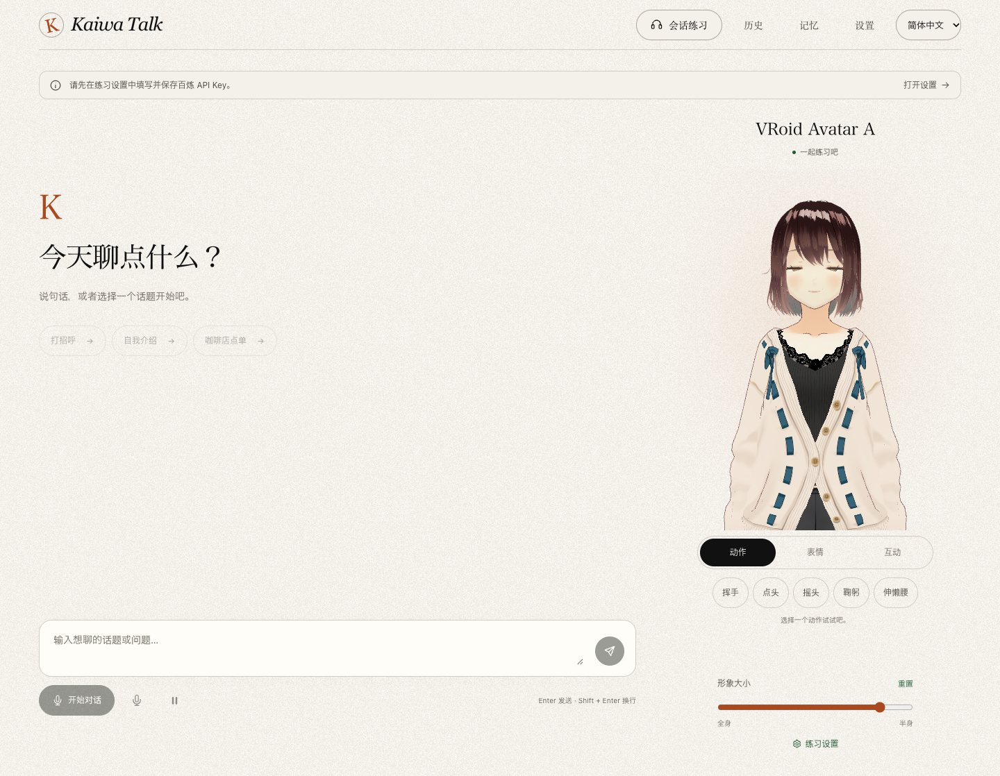
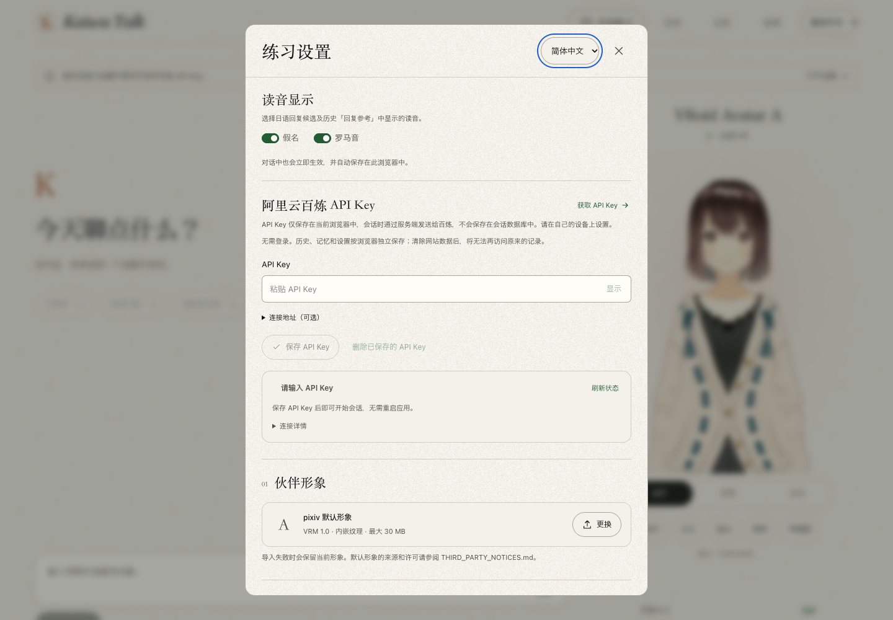

# Kaiwa Talk · AI 日语对练

[日本語](README.ja.md) · **简体中文** · [English](README.en.md)

**和虚拟伙伴聊几句，让日语从“想得出来”变成“说得出口”。**

[在线体验](https://kaiwa-talk.vercel.app/) · [应用源码](https://github.com/Altria1979/kaiwa-talk) · [问题反馈](https://github.com/Altria1979/kaiwa-talk/issues)

## 1. 项目背景与功能

学过单词和语法，真正开口时却不知道怎么接话，是日语练习中很常见的困难。Kaiwa Talk 希望提供一个随时可以开始、允许停顿和重来的对话环境：从打招呼、自我介绍、咖啡店点单等小话题出发，和屏幕里的 3D 虚拟伙伴进行语音或文字交流。

项目把大语言模型（LLM）、语音识别（ASR）、语音合成（TTS）和 VRM 虚拟形象连接起来。伙伴会听你说话、组织回复并朗读，配合口型、表情和字幕；不知道怎么继续时，可以查看回复候选、读音提示和日语解释，结束后再回顾这次学到的表达。

无需注册或网站密码。使用自己的阿里云百炼 API Key 开始对练；未配置密钥时仍可浏览界面、调整角色、查看动作和管理设置。界面支持日本語、简体中文和 English，首次打开默认日语。



| 功能 | 可以做什么 |
| --- | --- |
| 语音与文字对练 | 用日语说话，也可通过文字开始交流或提出问题；支持停止回复、麦克风静音与重新开启语音 |
| 对话辅助 | 查看 2 个推荐回答，假名与简体中文翻译在同一辅助行显示；可听示范音频或直接发送 |
| 重听与慢放 | 重听当前会话已合成的完整句，以 0.8 倍速度慢放并保持音高 |
| 日语解释与回顾 | 按需获取简明日语解释；会话结束后生成话题摘要、三个实用表达和一个改进建议 |
| 3D 虚拟伙伴 | 跟随音频的口型、表情与字幕；挥手、点头、鞠躬等动作，以及点击头部、身体、手部的互动 |
| 角色与练习设置 | 调整角色名字、性格、音色、难度和说话后的等待时间；导入自己的 VRM 0.x / 1.0 形象 |
| 历史与记忆 | 查看对话与学习回顾；主动保存、编辑或删除想让伙伴记住的偏好，不自动保存记忆建议 |
| 浏览器隔离 | 不同浏览器分别保存历史、记忆、角色设置和上传头像；同一浏览器刷新后可继续使用 |
| 三语界面 | 日本語、简体中文、English 即时切换；已有对话与学习内容不会因此被翻译或改写 |

语音输入以日语为主。中文求助或其他语言练习可以使用文字输入；回复候选的翻译使用简体中文，额外解释及学习回顾使用日语。AI 内容可能有误，本项目不提供发音评分或考试能力认证。

## 2. 使用教程

### 准备自己的 API Key

1. 打开[在线网站](https://kaiwa-talk.vercel.app/)，在页头切换到习惯的界面语言。
2. 打开「练习设置」，填写自己的阿里云百炼 API Key，点击「保存 API Key」。获取方式见[百炼官方说明](https://help.aliyun.com/zh/model-studio/get-api-key)。
3. 北京地域可使用默认接入地址。其他地域或业务空间需要展开接入地址选项，填写对应域名，例如新加坡的 `dashscope-intl.aliyuncs.com`。密钥与接入地址必须属于同一地域。
4. 选择练习难度、角色性格和音色，保存后开始对话。



API Key 只保存在当前浏览器的 localStorage 中，调用时通过项目服务端转发到百炼，不写入会话数据库、URL 或日志。localStorage 不加密，请使用自己的可信浏览器；可以在设置中更新或清除密钥。保存密钥只检查配置格式，不会调用收费模型，也不表示已验证账户权限或可用额度。实际对话、语音识别、语音合成、回复候选、解释与回顾会消耗你自己的服务额度。

### 开始一段对话

1. 点击「开始对话」并允许麦克风，也可以先输入文字。拒绝麦克风授权时仍可使用文字交流。
2. 从简单的话题开始，例如「こんにちは」「自己紹介をしたいです」或咖啡店点单。
3. 说完后稍作停顿，默认等待 **1.6 秒**提交发言，可在设置中调整。识别的内容、伙伴的回复和播放状态会在页面中显示。
4. 不知道怎么接话时，查看推荐回答的日语原文，以及同一辅助行中的假名与中文翻译。可点击「听示范」收听原句，或点击「发送」直接回复；假名显示可在设置中切换。
5. 想再听一遍时使用「重听」或「慢放」；也可以请求日语解释。想立即打断生成与播放时，点击「停止当前回复」。
6. 点击「结束对话」释放麦克风，等待学习回顾。可在「本次对话音频」中点击「导出音频」，保存自己的声音和本次实际播放的伙伴回复、重听及示例音频。只有主动点击保存的记忆建议，才会用于以后的对话。

导出录音仅暂存在当前页面，格式由浏览器支持情况决定（如 WebM 或 M4A）。请在开始下一段对话或刷新、关闭页面前下载；历史记录不能恢复这份录音。静音期间不会录入麦克风声音，纯文字且未播放音频的对话没有可导出的录音。麦克风和扬声器效果受设备、环境与浏览器影响，使用耳机通常有助于减少回声。

### 换一个喜欢的伙伴

在「练习设置 → 伙伴形象」上传 **VRM 0.x / 1.0** 模型，最大 **30 MB**，贴图与资源必须内嵌，不支持外部资源引用。导入失败时保留原形象。请先确认模型作者允许相应使用。

当前工作区的默认形象已在本地替换为用户提供的 **Violet Evergarden v1**（作者：Little Cwoissant），原始模型保留不变。其内嵌条款要求署名，并禁止再分发、商业使用和修改，因此不能随公开仓库或部署分发。可以调节全身到近景的取景大小，通过「动作／表情／互动」切换姿态、表情和触碰反应。动作互动本身不调用 AI；自定义模型缺少相应骨骼或表情时，部分操作不可用。模型来源与许可见[第三方声明](THIRD_PARTY_NOTICES.md)。

### 保存记录与保护隐私

- 网站免登录，自动为浏览器建立独立身份。历史、记忆、设置与头像保存在服务端，并按身份隔离；**不是所有数据都仅保存在浏览器本地**。
- 同一个浏览器配置文件和站点来源下，多个标签页共用记录；同一浏览器同时只能进行一段会话，不同浏览器可以分别对练。
- 清除网站数据、无痕窗口结束、换浏览器或更换域名后，可能失去原记录的访问权限；目前没有账号登录、跨设备同步或身份找回功能。
- 百炼接收用于识别的音频、对话上下文和需要合成的文本。完整对话录音仅在当前页面内存中暂存，并在你点击导出后下载到设备，不上传到服务端保存；密钥不会作为服务器默认凭据供他人使用。
- 旧版私人部署的共享数据仍保留在原表和文件中，不会自动分配或公开给新访客。

### 在本地运行

需要 **Node.js 24**、**pnpm 9.9.0**，以及支持 WebGL、Web Audio 和 AudioWorklet 的现代浏览器。在项目根目录执行：

```sh
git clone https://github.com/Altria1979/kaiwa-talk.git
cd kaiwa-talk
nvm use
corepack enable
pnpm install --frozen-lockfile
pnpm dev
```

打开 [http://localhost:3000](http://localhost:3000)。启动器同时运行 Next.js 网页和端口 3001 的 Node 服务。默认模型随仓库提供，VAD 资源在启动和构建时从锁定依赖生成，不需要另行下载人物。

端口被占用时可运行 `KAIWA_TALK_WEB_PORT=13000 pnpm dev`，服务端自动使用下一个端口。本地数据保存在忽略提交的 `data/` 目录中。使用内置模型名称无需 `.env.local`；API Key 仍在网页中配置。

构建并运行生产版本：

```sh
pnpm build
pnpm start
```

### 部署到自己的 Vercel

项目使用 **Vercel Services**：Next.js 提供页面，Node.js 容器处理 HTTP、WebSocket 和语音会话；Turso 保存结构化数据，**Private Vercel Blob** 保存上传模型。它需要服务端运行时，不是纯静态导出站点。

部署步骤、签名密钥、数据库与 Blob 环境变量见 [Vercel 部署指南](docs/vercel-deployment.md)。用户自备模型服务密钥，部署方承担应用、数据库、存储和流量费用。当前仅限制单个头像文件大小，尚未设置累计上传配额；面向更多访客开放前应配置部署侧限流、用量监控和存储管理。

## 3. 技术实现与开源致谢

### 技术栈

| 部分 | 实现 |
| --- | --- |
| 网页与类型 | [Next.js 16](https://github.com/vercel/next.js) App Router、[React 19](https://github.com/facebook/react)、[TypeScript 5.9](https://github.com/microsoft/TypeScript) |
| 界面与国际化 | CSS Modules、全局样式与自有中／日／英字典，三语共用应用路由 |
| 虚拟形象 | [Three.js](https://github.com/mrdoob/three.js) 与 [three-vrm](https://github.com/pixiv/three-vrm)，加载 VRM 0.x / 1.0 并驱动口型、姿态和表情 |
| 对话与语音 | 百炼 Qwen 对话模型、Fun-ASR 实时识别、Qwen 实时 TTS；默认模型由环境配置控制 |
| 音频与人声检测 | Web Audio、AudioWorklet、[vad-web](https://github.com/ricky0123/vad)、[Silero VAD](https://github.com/snakers4/silero-vad)、[ONNX Runtime](https://github.com/microsoft/onnxruntime) |
| 实时服务 | Node.js 24、[ws](https://github.com/websockets/ws)、HTTP API 与 WebSocket 事件协议 |
| 持久化 | 本地 [better-sqlite3](https://github.com/WiseLibs/better-sqlite3)，云端 Turso/libSQL 与私有 Vercel Blob |
| 质量与部署 | Node 内置测试、tsx、TypeScript、ESLint；Vercel Services 与 Docker 后端 |

### 核心实现

- **可取消的实时会话**：为回复分配独立轮次，协调识别、文本生成、分句合成与播放。停止或插话后取消旧任务，避免过期结果覆盖新回复。见 [`server/session.ts`](server/session.ts) 和 [`use-conversation.ts`](src/hooks/use-conversation.ts)。
- **语音与已听内容对齐**：浏览器只在完整句自然播完后确认播放；后续语音上下文区分已听内容与中断回复，重听与慢放复用本轮音频。见 [`browser-audio.ts`](src/lib/browser-audio.ts)。
- **轻量的开口检测**：本地 VAD 提供人声活动信号，结合云端有效识别内容确认插话；Fun-ASR 负责最终断句，不把录音串行提交两次。它不是发音评分系统。
- **浏览器身份隔离**：使用签名 HttpOnly Cookie，将 API、WebSocket、数据库查询、会话租约与私有头像路径绑定到同一身份。共享数据库连接不等于共享用户记录。见 [`cloud-access.ts`](shared/cloud-access.ts)、[`storage.ts`](server/storage.ts) 和 [`avatars.ts`](server/avatars.ts)。
- **角色表现与对话分离**：手动动作不触发对话请求；自动表情从同一次回复提取，口型由实际播放音量驱动，字幕近似跟随句内播放进度。见 [`avatar-stage.tsx`](src/components/avatar-stage.tsx)。

运行质量检查：

```sh
pnpm lint
pnpm typecheck
pnpm test
pnpm build
```

自动化测试使用模拟模型响应和临时存储，不需要真实百炼密钥。更多模型配置、音频限制、目录结构和故障排查见[开发与进阶使用指南](docs/development.md)。

### 参考与致谢

感谢上述开源项目的维护者，以及当前本地模型作者 Little Cwoissant。默认人物、VAD 模型、运行时资源及代码依赖各自遵循原有许可，出处与固定版本记录见 [THIRD_PARTY_NOTICES.md](THIRD_PARTY_NOTICES.md)。

本 README 的组织方式参考同作者的 [Pokotype](https://github.com/Altria1979/pokotype)：先介绍产品与使用方法，再说明技术实现及相关资料。

## 4. 联系作者

遇到语音连接、角色加载或对话体验问题，或希望交流日语学习场景，欢迎反馈：

- **WeChat／微信：`Altria1979`**
- GitHub：[Altria1979](https://github.com/Altria1979)
- 问题反馈：[提交 Issue](https://github.com/Altria1979/kaiwa-talk/issues)

请提供浏览器与系统版本、复现步骤、错误提示和必要截图，**不要附带 API Key、Cookie、环境文件或私人对话**。

## 5. 许可与第三方素材

本项目的应用源码采用 [MIT License](LICENSE)，版权归属 © 2026 Altria1979。第三方素材及依赖的许可见下文。

当前本地默认 VRM 角色适用文件内嵌的独立条款：要求署名，禁止再分发、商业使用和修改，**不适用本项目的 MIT 许可证，也不是 CC0**。依赖和随附资源继续遵循各自许可证。详见[第三方素材与代码声明](THIRD_PARTY_NOTICES.md)。
